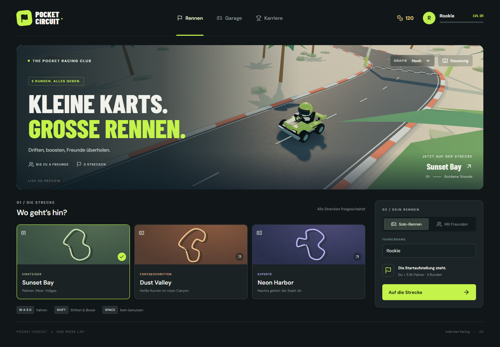
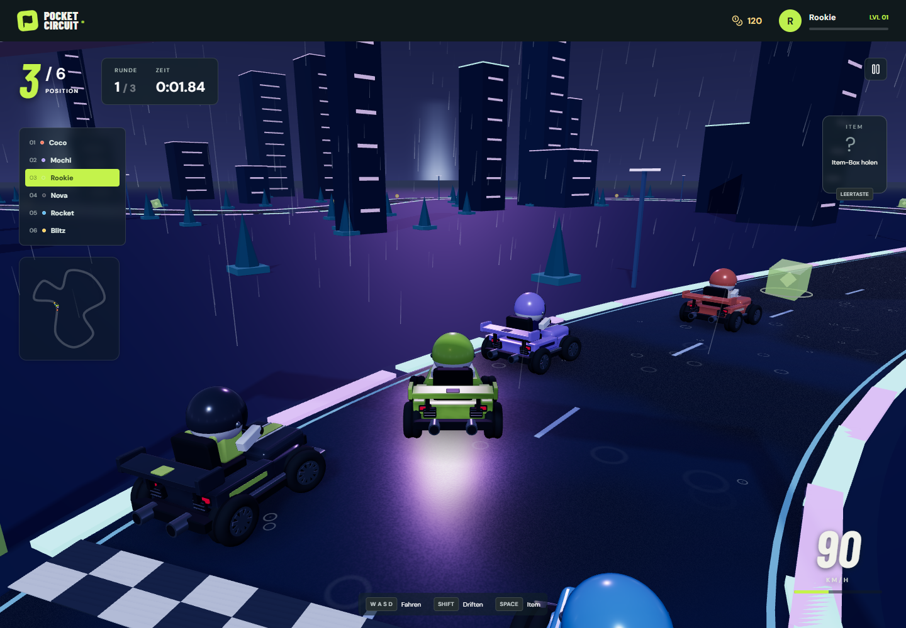

# Pocket Circuit 🏁

Ein eigenständiger 3D-Kart-Racer für den Browser. Mit privaten Multiplayer-Räumen, drei Strecken, Drift-Boosts, Items und einer freischaltbaren Garage. Eigene prozedurale Grafiken; keine Nintendo-Assets.



## Auf Vercel deployen

1. In [Vercel](https://vercel.com/new) **Add New → Project** öffnen und dieses GitHub-Repository importieren.
2. Das Projektverzeichnis bleibt `/`. Vercel erkennt **Vite**. Node.js **22.x** oder neuer verwenden.
3. **Deploy** klicken. Die Build-Einstellungen stehen bereits in `vercel.json`:
   - Build: `npm run build`
   - Ausgabe: `dist`
4. Die HTTPS-Adresse öffnen, **Mit Freunden → Raum erstellen** wählen und den Einladungslink teilen.

Für den Standardbetrieb sind **keine Umgebungsvariablen und keine eigene Datenbank** nötig. Die öffentliche PeerJS-Infrastruktur vermittelt die Verbindung, danach werden die Rennzustände direkt über WebRTC übertragen. Vercel liefert die statischen Dateien aus.

## Enthalten

- Drei komplette 3D-Strecken: **Sunset Bay**, **Dust Valley**, **Neon Harbor**.
- Drei Runden mit Countdown, Platzierungen, Bestzeiten und Ergebnisbildschirm.
- **Solo:** gegen fünf KI-Fahrer.
- **Multiplayer:** bis zu vier Menschen in einem privaten Raum, auf sechs Fahrer mit KI aufgefüllt.
- Host-gesteuerte Simulation: Gäste senden Eingaben; Positionen, Items und Ergebnisse berechnet der Host.
- Driften und aufgeladene Boosts; **Turbo**, **Schild**, **Impuls** aus Item-Boxen.
- Münzen, XP, Level und sechs kosmetische Skins mit identischen Fahrwerten.
- Geräte-lokaler Fortschritt in `localStorage`, mit Schutz vor doppelt vergebenen Rennbelohnungen.
- Tastatur und Touch-Steuerung, responsive Menüs und animierte 3D-Garagenvorschau.
- Reflektierender Klarlack, Metallfelgen, weichere Karosserien und HDR-Umgebungslicht.
- Echte planare Spiegelungen auf dem Meer und der nassen Straße in Neon Harbor, mit animierten Wellen und unregelmäßigen Pfützen.
- Wetter je Strecke: warme Küstenbeleuchtung und Wolken, Canyon-Staub oder Regen mit Spritzringen. Wetter ist visuell und verändert die Fahrwerte nicht.
- Kart-zu-Kart-Kollisionen und Randbegrenzungen mit Impulsen; KI vermeidet Verkehr, Schilde dämpfen Stöße.
- Gelenkte und rotierende Räder, Federung, Fahrerbewegung, Bremslichter, Drift-/Aufprallpartikel und eine reagierende Kamera.
- **Grafik → Hoch / Flüssig** im Menü und im Rennmenü; reduziert bei Bedarf Spiegelungsauflösung, Schatten und Partikel. Die Einstellung wird auf dem Gerät gespeichert.



## Steuerung

| Taste          | Aktion                                               |
| -------------- | ---------------------------------------------------- |
| W / ↑          | Gas geben                                            |
| S / ↓          | Bremsen / rückwärts                                  |
| A D / ← →      | Lenken                                               |
| Shift + Lenken | Driften; nach dem Aufladen loslassen für einen Boost |
| Leertaste      | Item einsetzen                                       |
| Esc            | Pause / Rennmenü                                     |

Auf Touch-Geräten erscheinen Bildschirmtasten. Online läuft das Rennen weiter, während ein Teilnehmer das Rennmenü geöffnet hat.

## Lokal starten

Voraussetzung: Node.js ≥ 22.12.

```bash
npm ci
npm run dev
```

Anschließend die von Vite ausgegebene lokale Adresse öffnen.

```bash
npm test          # Simulation, Fortschritt und Netzwerkprotokoll
npm run build    # TypeScript-Prüfung und Produktionsbuild
npm run preview  # Gebaute Version lokal ansehen
npm run test:graphics # Browser-Bilder und Shader-Prüfung für alle Strecken
```

### Browser- und Multiplayer-Test

```bash
npx playwright install chromium
npm run test:e2e
```

Der Test startet seinen eigenen Vite-Server und PeerServer. Er prüft echte WebRTC-Verbindungen in getrennten Browser-Kontexten, Gast-Eingaben, Bereitschaft, Streckenwechsel, späte Beitritte, Host-Abbruch, Solo-Steuerung und Mobilansichten. Screenshots landen in `test-results/browser/` und werden nicht eingecheckt. Unter Windows verwendet er standardmäßig den installierten Edge; auf anderen Systemen Playwright Chromium. Mit `PW_BROWSER_CHANNEL` lässt sich der Browser auswählen. Ports 5183 und 9010 müssen frei sein.

Mit `TEST_PUBLIC_PEER=1` verwendet derselbe Test den öffentlichen PeerJS-Dienst; dafür ist Internet nötig. Beispiel in PowerShell:

```powershell
$env:TEST_PUBLIC_PEER = '1'
npm run test:e2e
```

## Multiplayer-Betrieb

- Der Host-Tab muss geöffnet und aktiv bleiben. Hintergrund-Tabs können die Simulation drosseln. Beim Verlassen des Hosts endet der Raum.
- Gäste, die ein laufendes Rennen verlassen, werden durch KI ersetzt. Ein gestartetes Rennen ist für neue Beitritte geschlossen.
- Erst wenn alle menschlichen Fahrer fertig sind, kehrt der Host mit allen in die Lobby zurück.
- Nach vier Minuten wird ein Rennen beendet. Nicht angekommene Fahrer erhalten eine Teilnahmebelohnung, aber keine Bestzeit.
- Der kostenlose öffentliche PeerJS-Dienst ist eine externe Abhängigkeit ohne eigene Verfügbarkeitsgarantie. Für direkten Verbindungsaufbau können restriktive Firmen-, Mobilfunk- oder NAT-Netze einen TURN-Relay benötigen. Zwei Browser im gleichen Netzwerk beweisen keine Erreichbarkeit in jedem fremden Netzwerk.
- Für einen eigenen Signalserver gibt es `VITE_PEER_HOST`, `VITE_PEER_PORT`, `VITE_PEER_PATH` und `VITE_PEER_SECURE`. `.env.example` enthält Beispiele.
- `VITE_ICE_SERVERS` unterstützt eine JSON-Liste eigener STUN/TURN-Server. **Alle `VITE_*`-Werte sind öffentlich**. Dauerhafte geheime TURN-Zugangsdaten gehören nicht in den Client; verwende dafür eine eigene API, die kurzlebige Zugangsdaten ausgibt, und passe `peerOptions()` an.

Das Projekt ist ein spielbarer Arcade-Prototyp für private Runden. Es enthält kein öffentliches Matchmaking, keine Accounts, keine Cloud-Synchronisation und kein vertrauenswürdiges Wettkampf-/Anti-Cheat-System. Der Host und der lokal gespeicherte Fortschritt sind vom Spieler kontrollierbar. Fortschritt gilt je Browser und Website-Adresse; gelöschte Browserdaten löschen den Spielstand.

## Aufbau

```text
src/
  App.tsx               Menü, Garage, Karriere, Lobby und Ergebnisse
  GameSurface.tsx       Spielschleife, Eingaben und HUD
  game/simulation.ts    Fahrphysik, Strecken, KI, Items und Runden
  game/renderer.ts      Three.js-Welten, Karts, Effekte und Kamera
  game/kartVisuals.ts   Fahrzeugmodelle, Animationen und Partikel
  game/environment.ts  HDR-Himmel, Materialien und planare Spiegelungen
  game/weather.ts      GPU-Regen, Spritzringe, Wolken und Staub
  network.ts            PeerJS-Räume, Protokollvalidierung und WebRTC
  profile.ts            Münzen, XP, Käufe und lokale Speicherung
  shared.ts             Datentypen, Strecken- und Skin-Katalog
tests/                  Unit- und Browser-Tests
```

Stack: React, TypeScript, Vite, Three.js, PeerJS. Die 3D-Assets werden im Code erstellt. Google Fonts liefert optional Barlow Condensed und DM Sans; Systemschriften dienen als Fallback.

Referenzen: [Vercel für Vite](https://vercel.com/docs/frameworks/frontend/vite), [PeerJS](https://peerjs.com/client/api/peer), [PeerJS-Verbindungen und TURN](https://peerjs.com/client/faq).
